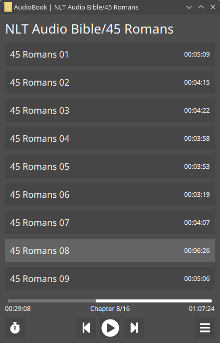

# audiobook
Minimal audio book reader for desktop.

# requirements:
QT5
c++

# build and run:
./install.sh

# build and install taglib:

cmake -DBUILD_EXAMPLES=ON .

or to a path: cmake -DCMAKE_INSTALL_PREFIX=/usr/

make

sudo make install

should install to /usr/local/include/taglib/

# screenshots
