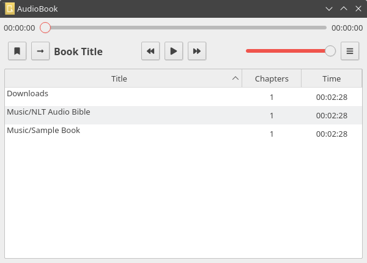

# audiobook
Minimal audio book reader for mobile and desktop.

# requirements:
Install qt5-charts && qt5-graphicaleffects
Install gdb && valgrind

# android
https://wiki.qt.io/Android

Install gradle 
Install jdk8 or jdk8-openjdk (preferred)  
JDK directory: /usr/lib/jvm/default

Enable adb run command: adb devices  

Install qt from here, dont use the aur version  
wget http://download.qt.io/official_releases/qt/5.12/5.12.9/qt-opensource-linux-x64-5.12.9.run

When installing android tools, will warn no space on device, exec the following:  
sudo mount -o remount,size=8G /tmp/

# screenshots - qml

# screenshots - qt5
